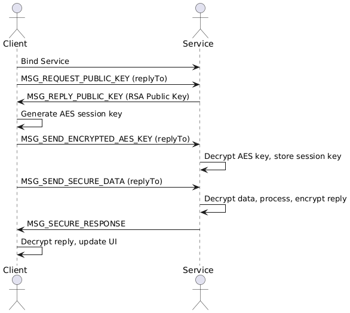

# Secure IPC Messenger — Design Document

---

## ✅ 1️⃣ Project Goal

This project demonstrates secure **App-to-App IPC** using the **Messenger pattern** with robust **hybrid RSA + AES encryption** on Android.

**Key objectives:**
- Client App (App A) securely communicates with Service App (App B).
- All data in transit is encrypted and authenticated.
- Uses a Foreground Service to comply with modern Android OS restrictions.

---

## ✅ 2️⃣ High-Level Architecture

+-------------------------+ +-----------------------------+
| Client App (A) | | Service App (B) |
| Module: app | | Module: service_app |
| | | |
| Compose UI ↔ ViewModel | <=====> | Messenger ↔ SecureService |
| | | |
+-------------------------+ +-----------------------------+

Common cryptography utilities live in the :shared module.

## ✅ 3️⃣ Modules

| Module | Purpose |
|--------|---------|
| `comm` | Client app: Compose UI, ViewModel, binding and transaction code |
| `service_app` | Foreground Service app: exposes Messenger service with secure crypto |
| `shared` | Contains `CryptoHelper` for RSA key generation and AES-GCM encryption |

---

## ✅ 4️⃣ Secure IPC Flow

| Step | Actor | Action |
|------|-------|---------|
| 1️⃣ | **Client** | Binds to `SecureService`. |
| 2️⃣ | **Client** | Sends `MSG_REQUEST_PUBLIC_KEY` to Service. |
| 3️⃣ | **Service** | Responds with its RSA Public Key (`MSG_REPLY_PUBLIC_KEY`). |
| 4️⃣ | **Client** | Generates AES session key, encrypts it with RSA, sends `MSG_SEND_ENCRYPTED_AES_KEY`. |
| 5️⃣ | **Service** | Decrypts AES key, stores it for this session. |
| 6️⃣ | **Client** | Encrypts user text with AES, sends `MSG_SEND_SECURE_DATA`. |
| 7️⃣ | **Service** | Decrypts text, processes, encrypts response with AES. |
| 8️⃣ | **Service** | Sends reply using `MSG_SECURE_RESPONSE`. |
| 9️⃣ | **Client** | Decrypts response, updates Compose UI. |

---

## ✅ 5️⃣ Sequence Diagram

